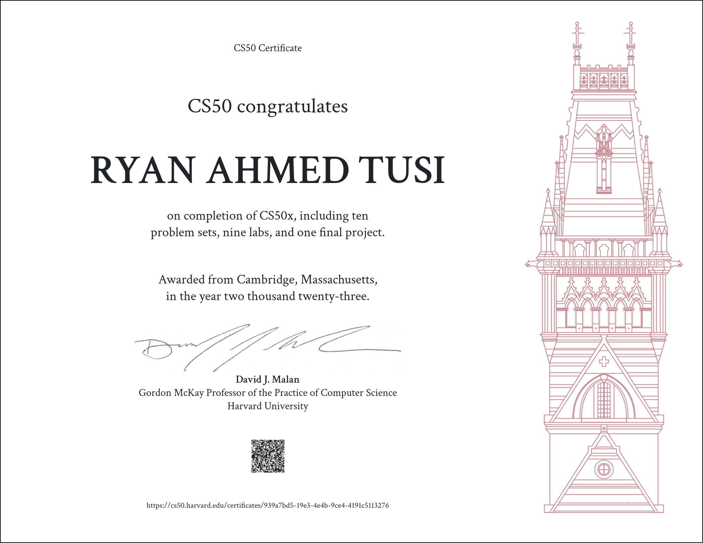

# CS50x: Introduction to Computer Science Repository

Welcome to the CS50x: Introduction to Computer Science repository! 🚀

This repository contains a comprehensive collection of problem sets (psets) and lab problems from Harvard's CS50x course, meticulously organized by weeks. Whether you're a beginner diving into the world of coding or a seasoned enthusiast looking to sharpen your skills, this repository offers a structured path to explore and conquer the fundamentals of computer science.

## Folder Structure

### Week 1 🌐
- **cash**: Dive into handling monetary change efficiently.
- **hello**: Begin with the quintessential "Hello, World!" program.
- **half**: Explore algorithms focusing on arithmetic and calculations.
- **debug**: Learn the art of debugging with specific exercises.
- **mario-less**: Create patterns using hashes and spaces, sans loops.
- **population**: Understand basic population growth using algorithms.

### Week 2 🧮
- **bulbs**: Tackle problems involving logical operations.
- **caesar**: Implement a Caesar cipher encryption algorithm.
- **hours**: Engage in problems related to time manipulation.
- **no-vowels**: Practice string manipulation without vowels.
- **password**: Explore algorithms related to secure password creation.
- **reliability**: Delve into the realm of reliability in code.
- **scrabble**: Work on algorithms associated with the popular word game.

### Week 3 🔍
- **plurality**: Dive into the world of voting algorithms.
- **run-off**: Explore the implementation of a ranked-choice voting system.
- **sort**: Engage in sorting algorithms to organize data efficiently.

### Week 4 📚
- **filter-less**: Explore image manipulation and filtering techniques.
- **recover**: Work on file recovery algorithms.
- **smiley**: Dive into the creation of ASCII art.

### Week 5 🔌
- **inheritance**: Understand inheritance in object-oriented programming.
- **speller**: Implement a spell-checking algorithm using hash tables.
- **trie**: Explore the Trie data structure.

### Week 6 🔨
- **bank**: Engage in banking-related algorithms and simulations.
- **dna**: Analyze DNA sequences using algorithms.
- **world-cup**: Explore algorithms related to sports simulations.
- **sentimental-cash**: A sentimental version of the cash problem.
- **sentimental-hello**: A sentimental version of the hello problem.
- **sentimental-mario-less**: A sentimental version of the mario-less problem.
- **sentimental-readability**: A sentimental version of the readability problem.

### Week 7 📊
- **favorites**: Work on algorithms related to user preferences.
- **fiftyville**: Engage in simulations related to city planning.
- **movies**: Dive into algorithms associated with movie databases.
- **songs**: Explore problems involving music databases.

### Week 8 🕸️
- **homepage**: Implement algorithms related to website development.
- **trivia**: Work on trivia-related algorithms and games.

### Week 9 🛠️
- **birthdays**: Explore algorithms related to birthday celebrations.
- **finance**: Dive into financial algorithms and simulations.

Feel free to navigate through the folders corresponding to each week's challenges. Every directory contains psets and lab problems carefully curated from CS50x, allowing you to develop a solid understanding of various programming concepts.

## Technologies Used
- **C**: The primary language used for problem-solving and coding exercises.
- **Python**: Utilized in certain problem sets and lab problems.
- **Git**: Version control system for managing the repository.
- **Flask**: Python Framework for web application
- **Sqlite3**: Database management
- **Bootstrap**: CSS framework
- **Javascript**: Website interactivity
- **HTML**
- **CSS**

## Getting Started
1. Clone this repository to your local machine using `git clone`.
2. Explore the folders categorized by weeks.
3. Select a week and dive into the respective psets and lab problems.
4. For more info on CS50: [click here](https://pll.harvard.edu/course/cs50-introduction-computer-science)

## Certificate

Happy coding! 🖥️💡✨

